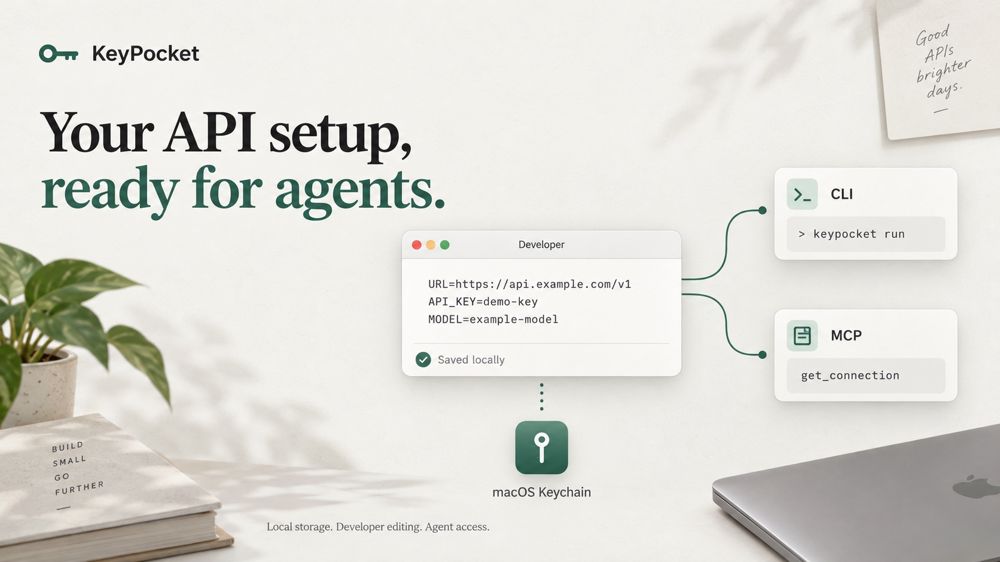

# KeyPocket



**A small native macOS app for API URLs, API keys, and environment variables — built for desktop AI agents.**

[简体中文](README.md) · [MIT License](LICENSE) · macOS 14+ · Apple Silicon

Store service configurations in macOS Keychain, edit them in a form or as dotenv text, and access them through a CLI or a local stdio MCP server. No account, subscription, or background HTTP service. Current version: **0.3.0**. The application UI is currently in Chinese.

## Features

- Group service names, descriptions, API URLs, keys, and extra variables.
- Paste `KEY=VALUE` text in Developer mode; import existing `.env` files.
- Store configuration in Keychain without a plaintext configuration database.
- Discover and read services through two read-only MCP tools.
- Inject a selected configuration into a child process without changing global environment variables.
- Compact SwiftUI / AppKit interface, 720 × 500 by default.

## Build and install

Requires an **Apple Silicon Mac with macOS 14+** and Xcode Command Line Tools, including Swift and the macOS SDK. The build script currently targets arm64 only. There are no third-party dependencies or Xcode project files. This repository provides a source build, not a notarized installer.

```sh
# Only if Command Line Tools are not installed; finish the system installer first
xcode-select --install

git clone https://github.com/Jamailar/KeyPocket.git
cd KeyPocket
bash build.sh

# Quit an existing installation before replacing it
mkdir -p "$HOME/Applications"
ditto .build/KeyPocket.app "$HOME/Applications/KeyPocket.app"
open "$HOME/Applications/KeyPocket.app"
```

The build produces an ad-hoc signed `.build/KeyPocket.app`. Keychain may request access approval after rebuilding or upgrading.

Optional CLI shortcut (does not overwrite an existing entry):

```sh
mkdir -p "$HOME/.local/bin"
ln -s "$HOME/Applications/KeyPocket.app/Contents/MacOS/KeyPocket" "$HOME/.local/bin/keypocket"
export PATH="$HOME/.local/bin:$PATH"
```

Add the PATH line to your shell configuration if you want it to persist. Otherwise, use the executable's full absolute path in the examples below.

## Manage a service

Choose **添加服务** (Add service), enter a name, and fill in the URL and API key. Use **Developer** to paste a document instead:

```dotenv
URL=https://api.example.com/v1
API_KEY=your-key
MODEL=example-model
```

The creation dialog parses the document when you click **保存** (Save). In the main window, Developer mode autosaves after about 850 ms of inactivity and attempts to save when you leave the view. Invalid input leaves the last saved configuration intact. Unsaved drafts survive view changes only within the current application session.

A Developer document replaces the entire variable list: removing a line removes the variable. Same-name variables retain their IDs and notes. Comments, order, and formatting are stored with the document; editing through the form regenerates text when necessary. The separate `.env` import dialog previews a merge and skips existing names unless overwrite is selected.

The parser supports blank lines, comments, `export NAME=value`, empty values, single and double quotes, and common double-quoted escapes. Names must match `[A-Za-z_][A-Za-z0-9_]*`. It rejects duplicates, NUL characters, unmatched quotes, and quoted values spanning physical lines. It never executes shell commands or expands `$VAR` / `${VAR}`. Empty documents are rejected.

URL and key roles are inferred only when there is a unique candidate, including `URL`, `API_URL`, `API_BASE_URL`, `API_KEY`, `KEY`, and `TOKEN`. All original names and values remain available in `environment`.

## CLI

```sh
# Metadata only: names, descriptions, sanitized URLs, and variable names
keypocket list

# Complete JSON, including real secrets; prefer IDs returned by list
keypocket get 'service-name-or-id'

# Inject configuration without printing secrets
keypocket run 'service-name-or-id' -- python3 script.py

# Generate MCP JSON or instructions for a terminal-capable agent
keypocket mcp-config
keypocket agent-instructions
```

`get` returns `id`, `name`, `description`, `api_url`, `api_key`, and `environment`. `list` removes URL user information, query strings, and fragments; it does not return other variable values. Names, notes, and URL paths are still metadata and should not contain secrets.

`run` inherits the parent environment and overrides matching names with the selected configuration. It uses `execvp`, preserving standard I/O, signals, and exit status. The calling shell and global environment are unchanged. Use an explicit `sh -c` when you need shell syntax such as pipes.

## Desktop agents and MCP

KeyPocket exposes a local stdio MCP server. Clients start the process themselves; the GUI does not need to stay open. It does not listen on a network port.

```json
{
  "mcpServers": {
    "keypocket": {
      "command": "/Users/YOUR_USERNAME/Applications/KeyPocket.app/Contents/MacOS/KeyPocket",
      "args": ["mcp"]
    }
  }
}
```

Replace `YOUR_USERNAME` with your actual username. JSON `command` values do not expand `~` or `$HOME`. Use **接入 Agent → MCP** in the app or `keypocket mcp-config` to obtain the actual executable path.

| Tool | Behavior |
| --- | --- |
| `list_connections` | List metadata without API keys or other variable values |
| `get_connection` | Read one service by `connection` ID or exact name, including its real secrets |

Each tool call reads the latest Keychain data. The server provides no write, command execution, or proxy tools. It implements newline-delimited JSON-RPC and negotiates MCP versions 2024-11-05, 2025-03-26, and 2025-06-18. Clients supporting only remote HTTP MCP cannot connect directly.

For installed Codex and Claude Code clients:

```sh
codex mcp add keypocket -- "$HOME/Applications/KeyPocket.app/Contents/MacOS/KeyPocket" mcp
claude mcp add --scope user --transport stdio keypocket -- "$HOME/Applications/KeyPocket.app/Contents/MacOS/KeyPocket" mcp
```

Reload MCP or restart the client after registering. Other local stdio clients can use the JSON configuration above. If access fails, verify the absolute executable path, run `list`, and open the GUI to handle any macOS Keychain prompt.

## Storage and security boundaries

- Configurations are JSON inside one Generic Password Keychain item: service `local.jam.keypocket.vault.v1`, account `vault`. Data format 2 also reads format 1. These identifiers are retained for compatibility.
- Keychain provides storage protection; the app does not have a separate master password, per-agent access control, or per-service permissions. It is not a security boundary against malicious processes running as the same user.
- An attached MCP client can read every saved service. `get` and `get_connection` return real credentials into the caller's output or tool context. Only connect trusted clients; use `run` when the task only needs to launch a program.
- Overview values are masked until revealed, then hidden after 30 seconds. Developer mode and editing forms display plaintext. Copied secrets are cleared after 30 seconds or normal app termination if the clipboard is unchanged; third-party clipboard history cannot be revoked.
- There is no cloud sync, backup export, recovery, undo, or automatic credential discovery. Keep an independent source for recovery. Removing the application does not automatically remove its Keychain item.
- This is an early version without an independent security audit or Apple notarization. Avoid concurrent editing from multiple app instances; cross-process writes are not coordinated.

See [SECURITY.md](SECURITY.md) for private vulnerability reporting. Never post real credentials in issues, pull requests, screenshots, or logs.

## Development and verification

```sh
bash build.sh
.build/KeyPocket.app/Contents/MacOS/KeyPocket --self-test
open -n .build/KeyPocket.app --args --preview
```

Self-tests use separate temporary Keychain items and clean them up. They cover dotenv parsing, invalid input, data compatibility, URL/key roles, preservation of extra variables, metadata redaction, Keychain operations, child environment injection, exit status, MCP initialization and tools, fresh reads, and a real stdio subprocess.

Preview mode uses fake in-memory data and never reads or writes the real vault; it may still use normal UI preferences.

`Store.swift` owns storage, parsing, and models; `App.swift`, `ConnectionViews.swift`, and `DeveloperView.swift` implement the UI; `AgentAPI.swift` implements JSON and MCP; `Main.swift` provides entry points and process launching; `AgentTests.swift` covers the agent contract. `build.sh` and `icon.swift` build and sign the app.

Contributions are welcome; see [CONTRIBUTING.md](CONTRIBUTING.md).

## License

[MIT](LICENSE) © 2026 Jamailar. Use, modify, and distribute, including commercially, under the license terms. Provided without warranty.
